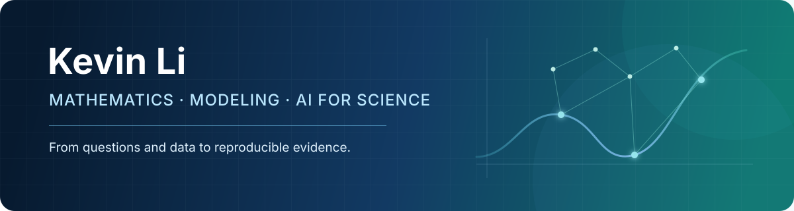

 

## Hello

I'm **Kevin Li**, a mathematics student at **Zhejiang Sci-Tech University**. My current interests sit at the intersection of mathematical modeling, machine learning, and reproducible research.

- 🧩 Building practical workflows for mathematical-modeling projects
- 🔬 Reading and testing research code in medical image classification
- ✍️ Writing about modeling, AI tools, and lessons learned along the way

## Selected work

| Project | What it contains |
|---|---|
| **[math-modeling.skill](https://github.com/ai-lcs/math-modeling.skill)** | An end-to-end Codex Skill for mathematical modeling: problem selection, data audit, model design, validation, visualization, paper writing, and submission review. |
| **[2026 MCM Problem C — Honorable Mention](https://github.com/ai-lcs/2026-MCM-Problem-C-Honorable-Mention)** | Our first university-level MCM project, including the problem, submitted paper, award certificate, and a concise account of the modeling approach. |
| **[Personal blog](https://ai-lcs.github.io/)** | Longer notes on mathematical modeling, learning, and the practical use of AI tools. |

Learning in public · Building carefully · Keeping results auditable

